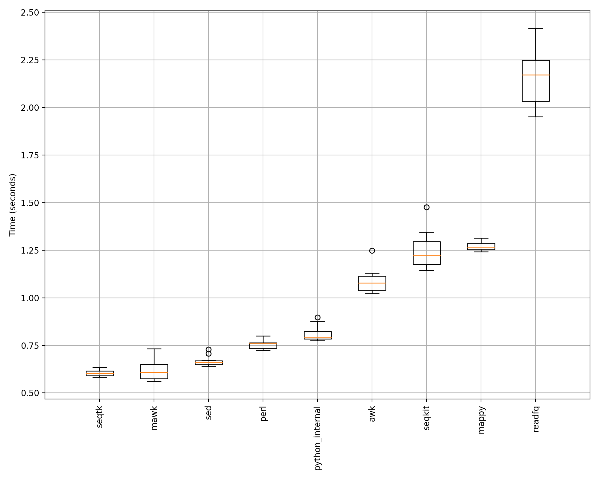

.. _benchmarking:

Benchmarking
============

Introduction
------------

Converters (e.g. :class:`~bioconvert.fastq2fasta.FASTQ2FASTA`) may have several
methods implemented. A developer may also want to compare his/her methods with 
those available in Bioconvert.

In order to help developers comparing their methods, we provide a benchmark
framework. 

Of course, the first thing to do is to add your new method inside the converter (see :ref:`developer_guide`) and use the method :meth:`~bioconvert.core.ConvBase.boxplot_benchmark`.

Then, you have two options. Either use the bioconvert command or use the bioconvert Python library. In both case you will first need a local data set as input file. We do not provide such files inside Bioconvert. We have a tool to generate random FastQ file inside the :func:`~bioconvert.simulator.fastq` for the example below but this is not generalised for all input formats. 

So, you could use the following code to run the benchmark fro Python:

.. plot::
    :include-source: 

    # Generate the dummy data, saving the results in a temporary file
    from easydev import TempFile
    from bioconvert.simulator.fastq import FastqSim

    infile = TempFile(suffix=".fastq")
    outfile = TempFile(suffix=".fasta")
    fs = FastqSim(infile.name)
    fs.nreads = 1000 # 1,000,000 by default
    fs.simulate()

    # Perform the benchmarking
    from bioconvert.fastq2fasta import FASTQ2FASTA
    c = FASTQ2FASTA(infile.name, outfile.name)
    c.boxplot_benchmark(N=10)

    infile.delete()
    outfile.delete()

Here, the boxplot_benchmark methods is called 10 times for each available method.

Be aware that the pure Python methods may be faster for small data and slower for large data. 
Indeed, each method has an intrinsec delay to start the processing. Therefore, 
benchmarking needs large files to be meaningful !

If we use 1,000,000 reads instead of just 1,000, we would get different results
(which may change depending on your system and IO performance):

Here, what you see more robust and reproducible results. 

Multiple benchmarking for more robustness
-------------------------------------------

With the previous method, even though you can decrease the error bars using more trials per method, we still suffer from
local computation or IO access that may bias the results. We provide a Snakefile here: :download:`Snakefile_benchmark`
that allows to run the previous benchmarking several times. So at the end you have a benchmark ... of benchmarks
somehow. We found it far more robust. Here is an example for the fastq2fasta case where each method was run 3 times and
in each case, 10 instances of conversion were performed. The orange vertical lines give the median and a final statement
indicates whther the final best method is significantly better than the others. 

.. image:: multi_benchmark.png

.. note:: The computation can be long and the Snakefile allows to parallelised the computation. 

Zenodo
~~~~~~

The benchmarking requires input files, which can be large. Those files are stored on Zenodo: https://zenodo.org/communities/bioconvert/

