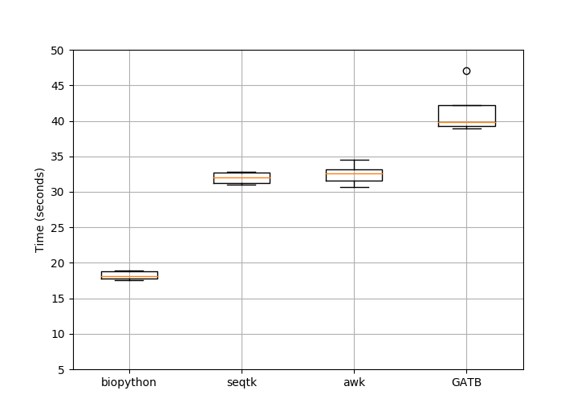
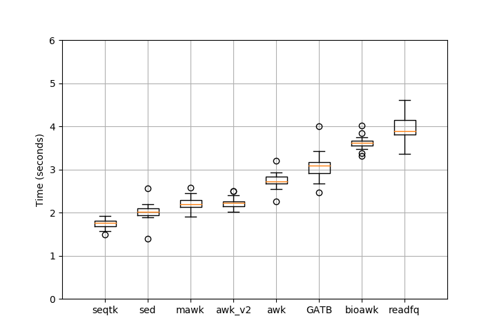

.. _benchmarking:

Benchmarking
============

Converters (e.g. :class:`~bioconvert.fastq2fasta.FASTQ2FASTA`) may have several
methods implemented. A developer may also want to compare his/her method with 
those available in bioconvert.

In order to help developers comparing their methods, we provide a benchmark
framework. One simply need to add his method inside the converter (see :ref:`developer_guide`) and use the method :meth:`~bioconvert.core.ConvBase.boxplot_benchmark`.

In practice, you would need a large test file. We do not provide such files
inside bioconverter. However, we provide some utilities to generate dummy data.
For the moment, only FastQ dummy generator is provided in
:mod:`bioconvert.simulator.fastq`.

In practice, you could use the following code to generate the boxplot:

.. plot::
    :include-source: 

    # Generate the dummy data, saving the results in a temporary file
    from easydev import TempFile
    from bioconvert.simulator.fastq import FastqSim

    infile = TempFile(suffix=".fastq")
    outfile = TempFile(suffix=".fasta")
    fs = FastqSim(infile.name)
    fs.nreads = 2000 # 1,000,000 by default
    fs.simulate()

    # Perfrm the benchmarking
    from bioconvert.fastq2fasta import FASTQ2FASTA
    c = FASTQ2FASTA(infile.name, outfile.name)
    c.boxplot_benchmark(to_exclude=["GATB"])

    infile.delete()
    outfile.delete()

Here, the boxplot_benchmark methods s called 5 times for each available method.

Be aware that the pure Python methods may be faster for small data set due to
a non-negligeable cost of using subprocess (we are working on an alternative at the moment). 

We have a dummy method, which does nothing else that calling a subprocess that
does ... nothing. You could use it that way::

    c.boxplot_benchmark(include_dummy=True)

and see that indeed this takes 1 second ! So we need more data.

If we use 1,000,000 reads instead of just 2,000, we would get this results
(which may change depending on your system and IO performance):

If we substract the subprocess cost from methods that use it (issue that should
be solved soon), then we would get this result

Here, what you see is that readfq and GATB methods (pure python) in this image
and the previous image give similar results. On the contrary, other methods (e.g., seqtk) 
are systematically shifted by about 0.5 to 1 second (cost of the subprocess).

So, your benchmarks should last  more than a few seconds.

