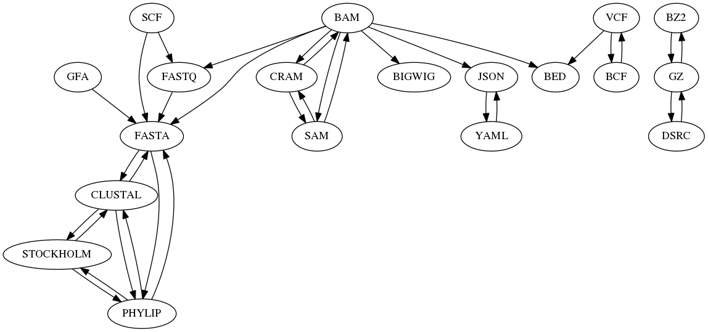

Bioconvert
####################

Bioconvert is a collaborative project to facilitate the interconversion of life science data from one format to another.

.. image:: https://badge.fury.io/py/bioconvert.svg
    :target: https://pypi.python.org/pypi/bioconvert

.. image:: https://img.shields.io/pypi/pyversions/bioconvert.svg
   :target: https://www.python.org

.. image:: https://secure.travis-ci.org/biokit/bioconvert.png
    :target: http://travis-ci.org/biokit/bioconvert

.. image:: https://coveralls.io/repos/github/biokit/bioconvert/badge.svg?branch=master
   :target: https://coveralls.io/github/biokit/bioconvert?branch=master

.. image:: http://readthedocs.org/projects/bioconvert/badge/?version=master
    :target: http://bioconvert.readthedocs.org/en/master/?badge=master
    :alt: Documentation Status

.. image:: https://badges.gitter.im/biokit/bioconvert.svg
    :target: https://gitter.im/bioconvert/Lobby?source=orgpage

.. image::  https://img.shields.io/github/issues/biokit/bioconvert.svg
    :target:  https://github.com/biokit/bioconvert/issues

:contributions: Please join the team to contribute: https://github.com/biokit/bioconvert/issues/1

Overview
################

Life science uses many different formats. They may be old, or with complex
syntax and converting those formats may be a challenge. **bioconvert** aims at providing a common tool / interface to convert life science data formats from one to another.

Many convertion tools already exist but they may be dispersed, focused on few
specific formats, difficult to install, or not optimised. With **bioconvert**, we plan to
cover a wide spectrum of format convertions; we will re-use existing tools when
possible and provide facilities to compare different conversion tools or methods 
via `benchmarking <benchmarking>`_. New implementations are provided when considered 
better than existing ones.

**Currently (June 2018), we have 66 formats, 120 direct conversions (much more are
possible calling bioconvert several times).**

Installation
###############

In order to install bioconvert, you can use **pip**::

    pip install bioconvert

This command installs bioconvert and its Python dependencies. Note, however,
that bioconvert may need extra non-Python dependencies as indicated in this
`requirements file <https://raw.githubusercontent.com/biokit/bioconvert/master/requirements_tools.txt>`_.

Since Jan 2018 we also provide some versions on bioconda. If you already have
bioconda setup on your system, just type::

    conda install bioconvert

Or if you have never done so, please add those channels before hand (provided
you have installed conda)::

    conda config --add channels r
    conda config --add channels defaults
    conda config --add channels conda-forge
    conda config --add channels bioconda

Otherwise, please see the instructions on `bioconda <https://bioconda.github.io/>`_ or
`Sequana <http://sequana.readthedocs.io/en/master/installation.html#from-bioconda-recommended>`_.

Usage
##########

From the command line, you can convert a fastq to fasta as follows (compressed
or not)::

    bioconvert fastq2fasta input.fastq output.fasta
    bioconvert fastq2fasta input.fq    output.fasta
    bioconvert fastq2fasta input.fq.gz output.fasta.gz
    bioconvert fastq2fasta input.fq.gz output.fasta.bz2
    bioconvert --help

From Python shell::

    # import a converter
    from bioconvert.fastq2fasta import Fastq2Fasta

    # Instanciate with infile/outfile names
    convert = Fastq2Fasta(infile, outfile)

    # the conversion itself
    convert()

User and Developer Guides
#############################

.. toctree::
    :maxdepth: 2
    :numbered:

    user_guide
    developer_guide
    benchmarking
    auto_examples/index
    references
    formats
    not_provided
    faqs
    glossary
    ChangeLog.rst

