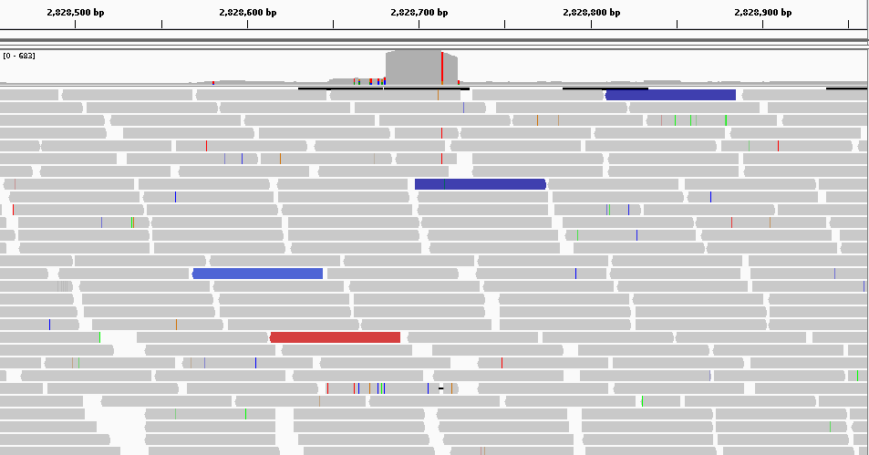

Tutorial
========

Here is a tutorial that allows you to quickly start **bioconvert** and see some features on a real data set.

We are looking to highlight CNVs (Copy Number Variation)
by identifying a significant increase in sequencing coverage in the following samples

Data
----

For this tutorial, we will work with 6 sequencing samples of the *Staphylococcus aureus* genome :

#. `ERR043367 <https://www.ncbi.nlm.nih.gov/sra/?term=ERR043367>`_
#. `ERR043371 <https://www.ncbi.nlm.nih.gov/sra/?term=ERR043371>`_
#. `ERR043375 <https://www.ncbi.nlm.nih.gov/sra/?term=ERR043375>`_
#. `ERR043379 <https://www.ncbi.nlm.nih.gov/sra/?term=ERR043379>`_
#. `ERR142616 <https://www.ncbi.nlm.nih.gov/sra/?term=ERR142616>`_
#. `ERR316404 <https://www.ncbi.nlm.nih.gov/sra/?term=ERR316404>`_

But these files are compressed in SRA format while we want fastq files.

Downloading
~~~~~~~~~~~

To download archive files (SRA)::

    bioconvert sra2fastq ERR043367

So we download the ERR043367 archive in SRA format to convert them into fastq just with the sample id.

It's paired sequencing so bioconvert creates two fastq files :

- ERR043367_1.fastq (contains the reads 1)
- ERR043367_2.fastq (contains the reads 2)

Bioconvert behaves differently when it's single sequencing but always with the same syntax,
for example the ERR3295124 sample is single sequencing. let's try::

    bioconvert sra2fastq ERR3295124

It's exactly the same command for single sequencing, but only one file as output :

- ERR3295124.fastq

Compression
~~~~~~~~~~~

Fastq files can be huge. If you want to conserve the files bioconvert can perform compression on the fly
but in this case you have to be explicit (specify the output, with the gz extension)::

    bioconvert sra2fastq ERR043367 ERR043367.fastq.gz

Mapping
-------

Now, from fastq files, we can perform an alignment on the reference genome using bwa for example::

    bwa index staphylococcus_aureus.fasta
    bwa mem -M -t 4 staphylococcus_aureus.fasta ERR043367_1.fastq ERR043367_2.fastq > ERR043367.sam

.. note:: **Find the reference genome of staphylococcus aureus with the accession FN433596 on** `NCBI <https://www.ncbi.nlm.nih.gov/nuccore/FN433596>`_ :

We get a sam file that we can visualize but if you want to reduce the size of the file.

You can used bioconvert by two ways to convert the sam file to a bam file:

    1. Implicit way::

        bioconvert ERR043367.sam ERR043367.bam

This is the implicit way because bioconvert deduces the converter to use
from the input and output extension

    2. Explicit way::

        bioconvert sam2bam ERR043367.sam

By this way, we specify the converter so bioconvert is able to deduces the extension of the output file.

.. note:: In both cases, we have the same output file (ERR043367.bam)

Visualization
-------------

Then from this bam file you can visualize the mapping with igv for example.

Here we have a global view of 500bp from the position 2.828.460 to 2.828.960 using IGV. From this point of view, we can see a significant difference between the region in red and the other two blue.

We expected to obtain fairly uniform coverage across all samples.
But on this region we observe that this is not the case.
We can therefore say that there is a possible variation in the number of copies.

In order to confirm what we saw,
We want to convert our alignment (BAM) to a BED file to know the number of reads mapped by position::

    bioconvert bam2bedgraph ERR043367.bam ERR043367.bed

In this bed file, we can check the visual results obtained a little earlier
with word processing tools that allow us to get some quick statistics like the average coverage (168)
and compare to the most covered regions to identify CNVs.

On all the samples we have identified 2 regions that are significantly more covered.
